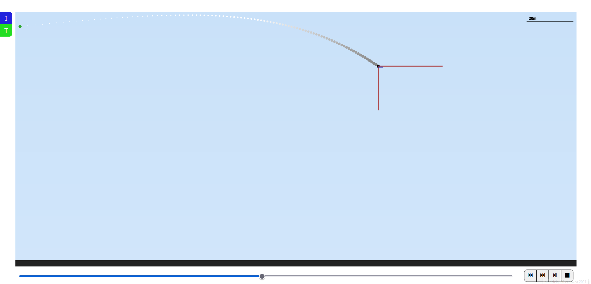
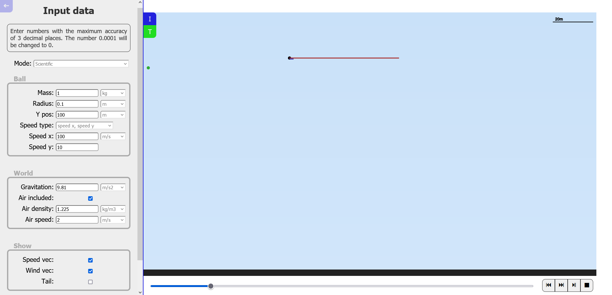
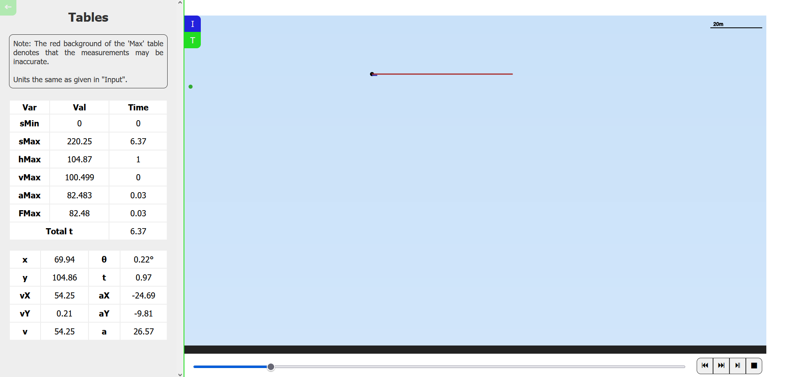
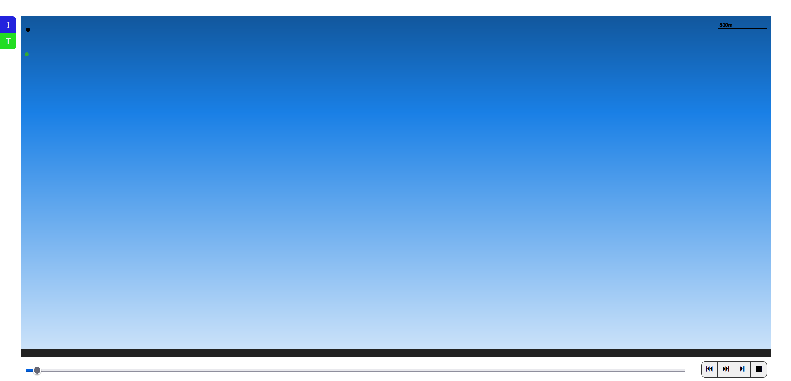

# ball-simulation

Simulating ball movement when gravity and air resistance is taken into consideration.

### Simulation

### Setting input parameters

### Analyzing data

### Background gradient reflects changes in height.

